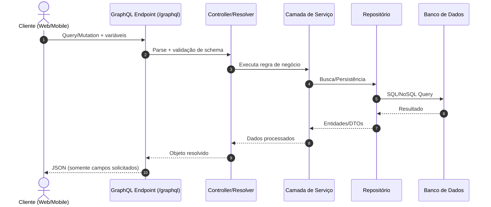

# Spring Boot + GraphQL

Este repositório demonstra, de forma didática, como estruturar uma API GraphQL usando Spring Boot.

## O que é GraphQL?

GraphQL é uma linguagem de consulta para APIs e também um runtime para executar essas consultas. Diferente de APIs REST tradicionais, onde normalmente existem múltiplos endpoints, no GraphQL usamos um endpoint único e declaramos exatamente quais campos queremos receber.

Principais benefícios:

- **Menos overfetching**: o cliente solicita apenas os dados necessários.
- **Menos underfetching**: evita chamadas em sequência para completar informações.
- **Evolução de schema**: adicionar novos campos tende a ser mais simples e menos disruptivo.
- **Tipagem forte**: o schema funciona como contrato claro entre frontend e backend.

## Fluxo completo da requisição (Mermaid)



## Conceito do Mermaid e quando usar

**Mermaid** é uma sintaxe textual para criar diagramas diretamente em Markdown. Em vez de desenhar manualmente, você descreve o fluxo em texto e o renderizador gera o diagrama.

### Casos de uso comuns

- **Documentação de arquitetura**: mostrar como os componentes da aplicação se comunicam.
- **Fluxos de negócio**: descrever etapas de cadastro, aprovação, pagamento etc.
- **Onboarding técnico**: acelerar entendimento de novos membros do time.
- **Revisões técnicas**: facilitar discussões de design em Pull Requests.
- **Manutenção viva da documentação**: como está em texto, é versionável junto ao código.

## Exemplo de query GraphQL

```graphql
query BuscarLivro($id: ID!) {
  livro(id: $id) {
    id
    titulo
    autor {
      nome
    }
  }
}
```

## Boas práticas

- Defina um schema claro e consistente.
- Trate erros com mensagens objetivas para cliente e logs detalhados no servidor.
- Aplique paginação em listas grandes.
- Utilize DataLoader para reduzir problemas de N+1 queries.
- Proteja operações sensíveis com autenticação/autorização.
